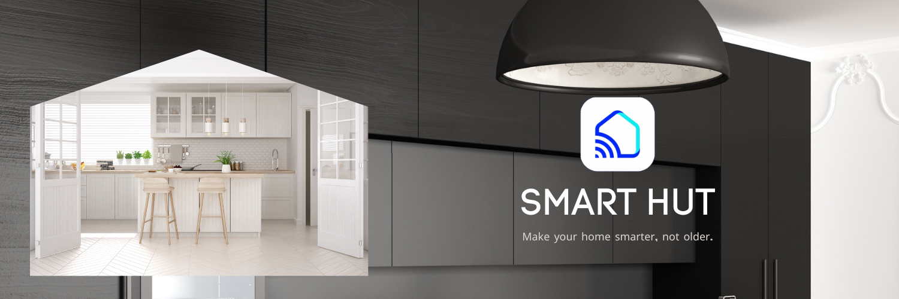

# Smarthut

This solution leverages the Internet of Things (IoT) to transform traditional home appliances into smart devices that can be easily controlled through a user-friendly mobile application. By utilizing this application, users can remotely access and manage their appliances, ensuring greater convenience and enhanced efficiency in their daily lives. users to control and monitor their home automation devices from anywhere with an Internet connection.

## Getting Started

These instructions will get you a copy of the project up and running on your local machine for development and testing purposes.

### Prerequisites

- [Node.js](https://nodejs.org/)
- [React Native](https://reactnative.dev/)
- [Firebase Account](https://firebase.google.com/)
- [OpenWeather API Key](https://openweathermap.org/api)
- [Xcode](https://developer.apple.com/xcode/) (for iOS development) or [Android Studio](https://developer.android.com/studio/) / [VS code](https://code.visualstudio.com/) (for Android development)

### Requirements

- Set of hardware like Node MCU to convert traditional home appliances into smart devices
- An Internet connection
- A supported smartphone or tablet

### Installing

1. Clone this repository: `git clone https://github.com/YOUR-USERNAME/home-automation.git`
2. Install dependencies: `npm install` or `yarn install`
3. Create a file called `secrets.js` in the root of the project and add your Firebase and OpenWeather API keys like this:
```
export const firebaseConfig = {
apiKey: "YOUR_API_KEY",
authDomain: "YOUR_AUTH_DOMAIN",
databaseURL: "YOUR_DATABASE_URL",
projectId: "YOUR_PROJECT_ID",
storageBucket: "YOUR_STORAGE_BUCKET",
messagingSenderId: "YOUR_MESSAGING_SENDER_ID"
};

export const openWeatherApiKey = "YOUR_API_KEY";

```
For more detials checkout [Firebase React Native](https://rnfirebase.io/) & [OpenWeather](https://openweathermap.org/)


4. Run the app: `react-native run-ios` or `react-native run-android`

## Built With

- [React Native](https://reactnative.dev/) - A JavaScript framework for building native mobile apps
- [Firebase](https://firebase.google.com/) - A cloud-based platform for managing data and building apps
- [OpenWeather API](https://openweathermap.org/api) - A global weather data API

## Features

- **Control devices**: Turn devices on or off, adjust settings, and set schedules remotely.
- **RGB light control**: Customize the color and intensity of RGB lights.
- **Monitor devices**: View real-time status and usage data for connected devices.
- **Integrations**: Connect to a variety of home automation platforms and devices.
- **Current weather display**: View the current weather conditions for your location.
- **Security**: Securely access the app using login credentials or biometric authentication.
- **Notifications**: Receive alerts and notifications for important events or changes.

## Screenshots

|                                                Splash Screen                                                 |                                                 Login Screen                                                  |                                                Register Screen                                                 |                                                  Reset Password Screen                                                  |
| :---------------------------------------------------------------------------------------------------------: | :--------------------------------------------------------------------------------------------------------------: | :----------------------------------------------------------------------------------------------------------: | :--------------------------------------------------------------------------------------------------------------: |
| 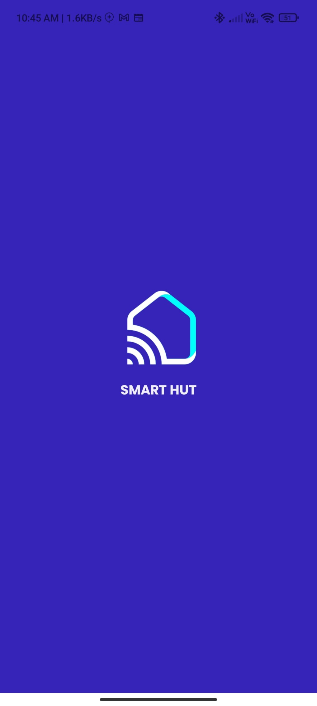 | 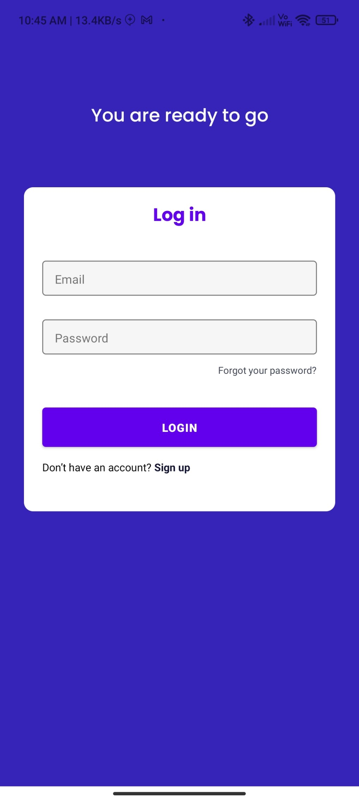 | 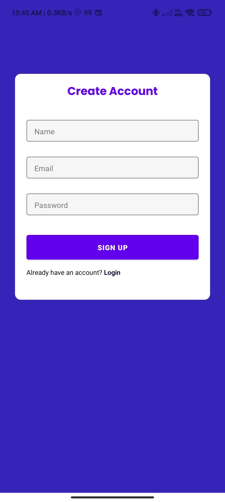 | 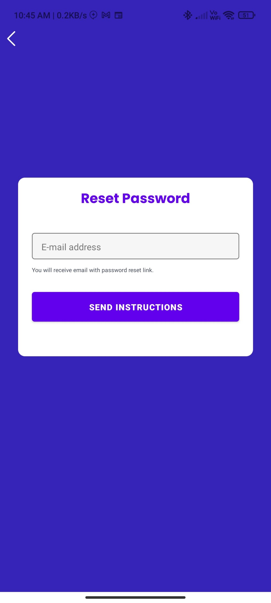 |

|                                                Control panel Screen                                                 |                                                 RGB Control Screen                                                  |                                                Routine Screen                                                 |                                                  Profile Screen                                                  |
| :---------------------------------------------------------------------------------------------------------: | :--------------------------------------------------------------------------------------------------------------: | :----------------------------------------------------------------------------------------------------------: | :--------------------------------------------------------------------------------------------------------------: |
| 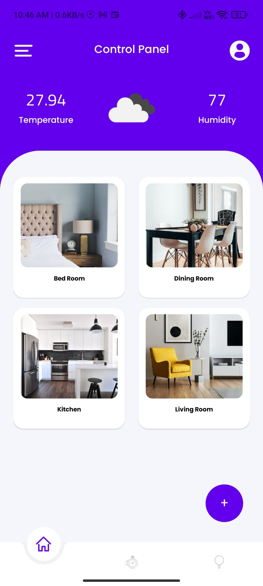 | 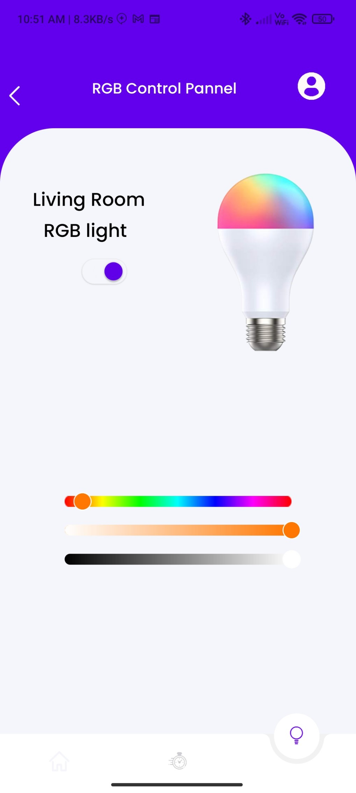 | 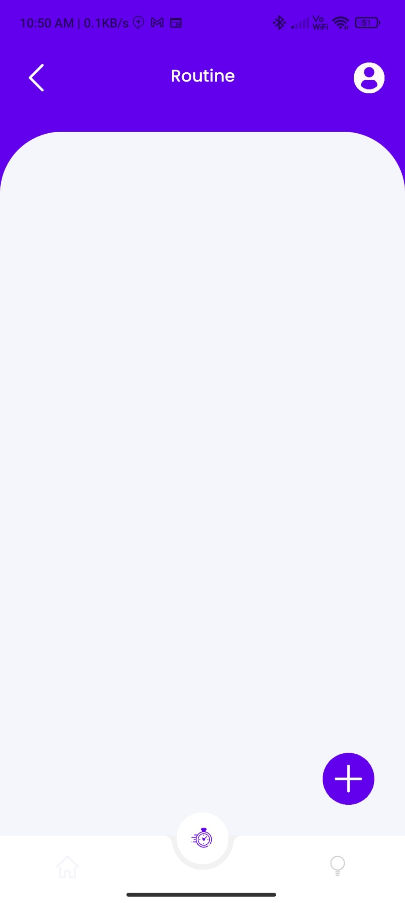 |  |

|                                                Area Based Screen                                                 |                                                 Weather Data Screen                                                  |                                                Create routine Screen                                                 |                                                  Node mcu source code                                                  |
| :---------------------------------------------------------------------------------------------------------: | :--------------------------------------------------------------------------------------------------------------: | :----------------------------------------------------------------------------------------------------------: | :--------------------------------------------------------------------------------------------------------------: |
| 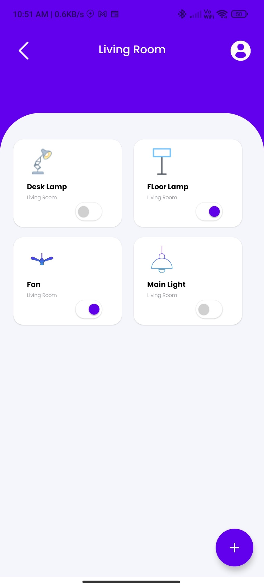 | 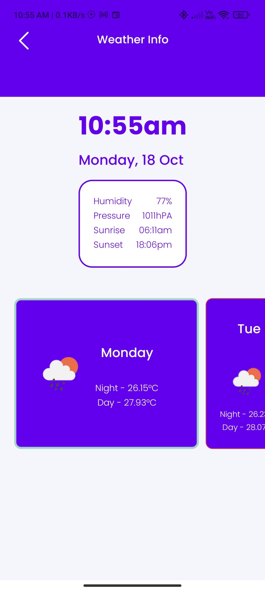 | 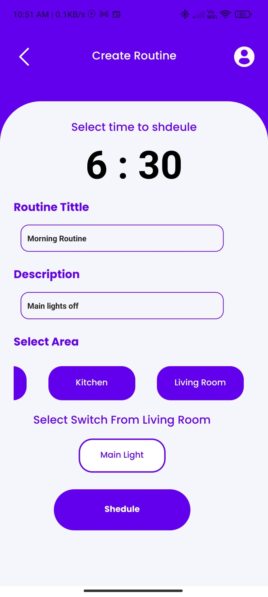 | 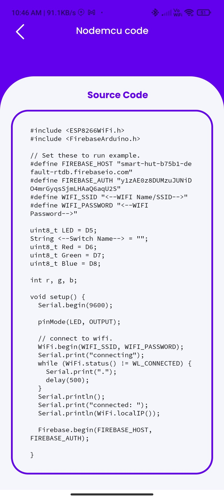 |


## Contributing

If you would like to contribute to this project, please follow these guidelines:

1. Fork the repository
2. Create a new branch for your feature (`git checkout -b my-feature`)
3. Commit your changes (`git commit -am 'Add some feature'`)
4. Push to the branch (`git push origin my-feature`)
5. Create a new Pull Request

## Support

If you have any issues or questions, please don't hesitate to reach out at [muhammednaseeb02@gmail.com](mailto:muhammednaseeb02@gmail.com). You can also find additional resources and support for using Firebase in our [Firebase documentation](https://rnfirebase.io/).
